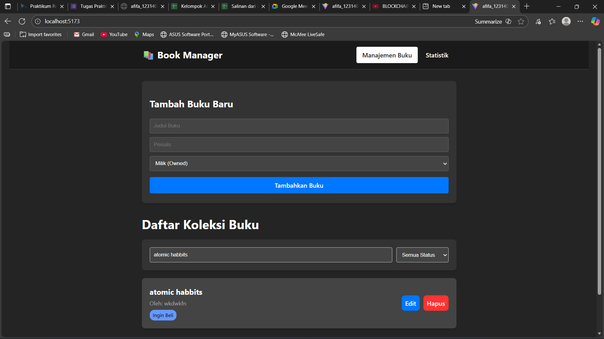
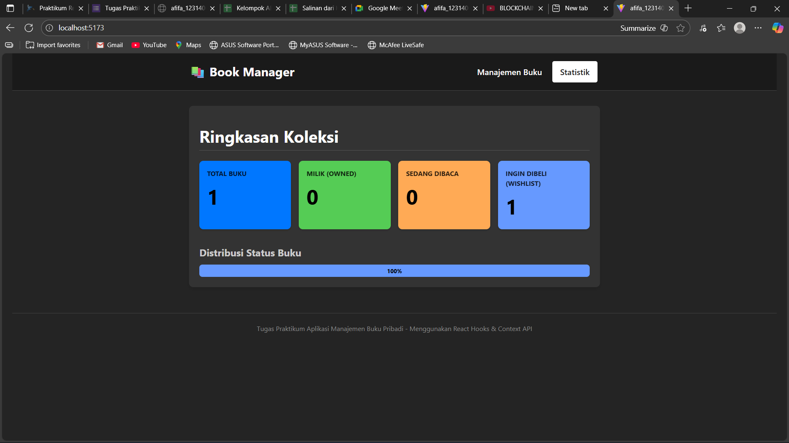

# 📚 Aplikasi Manajemen Buku Pribadi

Aplikasi ini adalah tugas praktikum mata kuliah [Nama Mata Kuliah Anda] yang bertujuan untuk mendemonstrasikan penguasaan konsep React modern (Hooks dan Context API) serta manajemen data lokal menggunakan `localStorage`.

Aplikasi ini memungkinkan pengguna untuk mencatat dan mengelola koleksi buku pribadinya berdasarkan tiga status utama: **Milik (Owned)**, **Sedang Dibaca (Reading)**, dan **Ingin Dibeli (Wishlist)**.

---

## Fitur Aplikasi

1.  **CRUD Buku:**
    * Menambah buku baru (Judul, Penulis, Status).
    * Mengedit detail buku yang sudah ada.
    * Menghapus buku dari koleksi.
2.  **Manajemen Data:**
    * Pencarian instan berdasarkan Judul atau Penulis.
    * Penyaringan (Filter) berdasarkan status buku (`milik`, `baca`, `beli`, atau `all`).
3.  **Statistik:**
    * Halaman khusus untuk melihat ringkasan data (Total Buku, Jumlah per status).
    * Data disimpan secara persisten di browser menggunakan `localStorage`.

---

## ⚙️ Instruksi Instalasi dan Menjalankan Proyek

Proyek ini dibangun menggunakan **Vite** dan React. Pastikan Anda sudah menginstal Node.js 

1.  **Clone Repository (Jika ada, atau lewati jika sudah memiliki file):**
    ```bash
    # Ganti dengan perintah clone repo Anda jika diperlukan
    # git clone <URL_REPO>
    # cd <nama_folder_proyek>
    ```

2.  **Instal Dependensi:**
    ```bash
    npm install
    ```

3.  **Menjalankan Aplikasi (Development Mode):**
    ```bash
    npm run dev
    ```
    Aplikasi akan berjalan di `http://localhost:5173/` (atau port lain yang ditunjukkan oleh terminal).

    ## 📸 Screenshot Antarmuka




---

## ⚛️ Penjelasan Fitur React yang Digunakan

Aplikasi ini mengimplementasikan konsep React yang kompleks untuk *state management* dan efisiensi:

### 1. Context API (BookContext.js)
* **Tujuan:** Mengatasi *prop drilling* dan menyediakan *state* buku secara global.
* **Implementasi:** State utama (`books`, `searchTerm`, `filterStatus`) disimpan dalam `BookProvider`. Fungsi manipulasi data (`addBook`, `updateBook`, `deleteBook`) juga disediakan melalui Context sehingga semua komponen (seperti `BookForm`, `BookList`, dan `StatsPage`) dapat mengakses dan mengubah data tanpa perlu meneruskan *props* secara manual.

### 2. Custom Hooks
* **`useLocalStorage.js` (State Persistence):** Hook kustom yang menggabungkan `useState` dan `useEffect` untuk otomatis menyinkronkan data koleksi buku dengan browser `localStorage`. Ini memastikan data tidak hilang saat halaman di-*refresh*.
* **`useBookStats.js` (Logic Layer):** Hook kustom ini menerima array buku dan menggunakan `useMemo` untuk secara efisien menghitung dan mengembalikan objek statistik (`{total, milik, baca, beli}`). Penggunaan `useMemo` mencegah perhitungan ulang statistik kecuali data buku berubah.

### 3. Komponen Reusable
* Tiga komponen utama (`BookForm`, `BookItem`, `BookFilterSearch`) dirancang sebagai komponen fungsional yang menggunakan *Hooks* (`useState`, `useContext`) untuk mengelola logika dan tampilannya, memastikan kode bersih dan mudah dirawat.

### 4. Navigasi
* **React Router** disimulasikan menggunakan *state* lokal (`currentPage` di `App.jsx`) untuk mengelola tampilan multi-halaman (`HomePage` dan `StatsPage`), memenuhi persyaratan navigasi multi-halaman tugas.

---

## 🧪 Laporan Unit Testing
